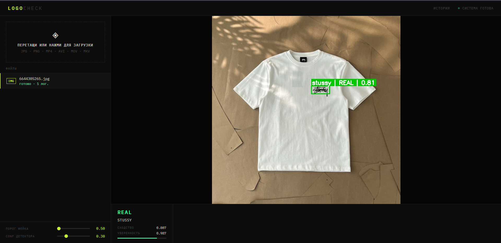
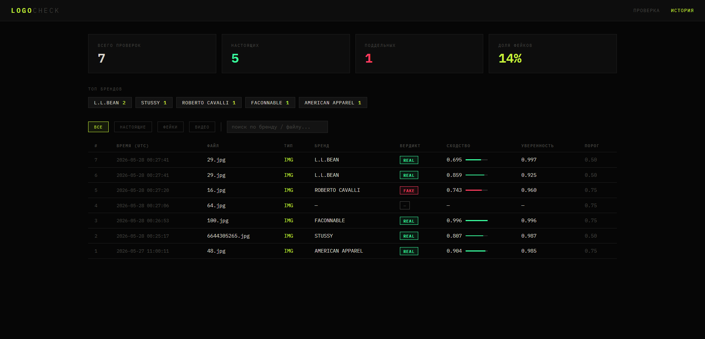
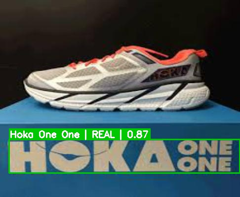
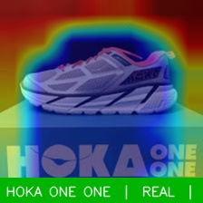
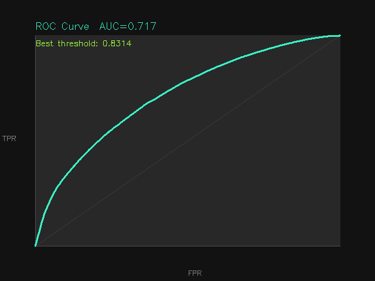
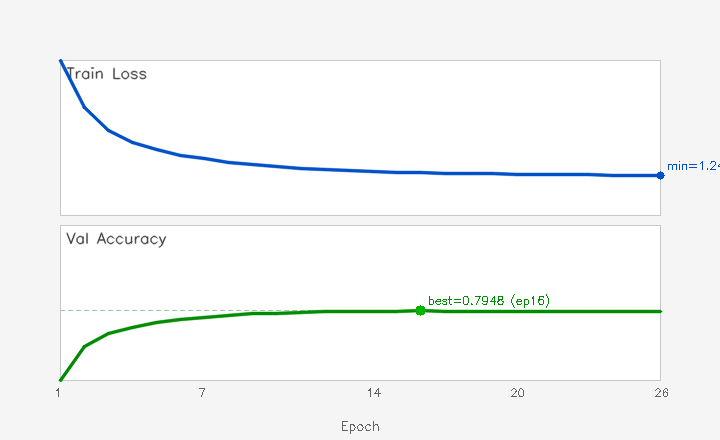

# 🔍 LogoCheck - система верификации подлинности логотипов

<p align="center">
  
  
  
  
  
</p>

---

> **Дипломная работа**
>
> **Тема:** Разработка автоматизированной системы распознавания логотипов
>
> **Автор:** <!-- Schkurmetov Ваше Имя Отчество --> Шкурметов Артём Александрович 
>
> **Группа:** <!-- номер группы --> ИИ-221
>
> **Научный руководитель:** <!-- ФИО руководителя --> Сазонова А.Т.
>
> **Учебное заведение:** <!-- название вуза --> ГрГУ им. Янки Купалы
 
---
 
Автоматизированная система для обнаружения и верификации подлинности логотипов брендов одежды на фото и видео. Двухэтапный пайплайн: **YOLOv8** находит логотип на изображении → **EfficientNet-B0** определяет бренд и сравнивает с эталонной базой.

---

## Как это работает

```
Фото / Видео
     │
     ▼
┌─────────────┐     ┌──────────────────┐     ┌─────────────────────┐
│  YOLOv8n    │────▶│   EfficientNet-B0│────▶│  KMeans-верификация │
│  Детекция   │     │  Классификация   │     │  Косинусное сходство│
└─────────────┘     └──────────────────┘     └─────────────────────┘
     │                      │                          │
  bounding box           бренд                   REAL / FAKE
```

Ключевая особенность: эталонная база хранит не один усреднённый вектор на бренд, а **K=5 KMeans-кластеров**. Это позволяет корректно обрабатывать бренды с несколькими визуальными вариантами логотипа (чёрный/белый, вышивка/принт и т.д.).

---

## Возможности

- ✅ Верификация фотографий - REAL / FAKE с числовым показателем сходства
- ✅ Обработка видеофайлов с трекингом и сглаживанием вердикта
- ✅ Режим веб-камеры в реальном времени
- ✅ Веб-интерфейс с drag & drop загрузкой файлов
- ✅ История всех проверок в SQLite с фильтрацией
- ✅ GradCAM-визуализация - показывает на что смотрит нейросеть
- ✅ Синтетические фейки и ROC-кривая для оценки системы
- ✅ Сравнительный анализ архитектур (EfficientNet / ResNet / MobileNet)
- ✅ Экспорт моделей в ONNX
- ✅ Docker-контейнеризация

---

## Демонстрация

### Веб-интерфейс


### Результат верификации

### GradCAM - на что смотрит нейросеть


### ROC-кривая верификационного модуля


### Кривые обучения классификатора


---

## Результаты

| Метрика | Значение |
|---|---|
| Детектор mAP50 | _0.57955_ | 
| Детектор mAP50-95 | _0.31046_ |
| Классификатор val_accuracy | _0.7896_ |
| Брендов в базе | 604 |

---

## Как запустить

### Вариант А: использовать готовые веса 

Самый простой способ - скачать уже обученные модели и сразу запустить систему без обучения.
 
**Шаг 1 - скачай веса:**
 
Скачай архив с обученными моделями: [**📦 Скачать веса (Google Drive)**](https://drive.google.com/drive/folders/1YnMzDOG9tvFfEGXJe7eY65ziqHOV_So0?usp=sharing)
 
Архив содержит:
```
logo_recognition_work/
├── runs/detect/logo_detector/weights/best.pt    — детектор YOLOv8
├── brand_classifier.pt                          — классификатор брендов
├── reference_embeddings.pt                      — эталонная база KMeans
└── classes.txt                                  — список брендов (604 бренда)
```
 
Распакуй в любую папку, например `D:\logo_recognition_work\`.
 
**Шаг 2 - клонируй репозиторий:**
 
```bash
git clone https://github.com/Schkurmetov/LogoCheck.git
cd LogoCheck
```
 
**Шаг 3 - создай окружение Python 3.11:**
 
```bash
py -3.11 -m venv .venv311
.venv311\Scripts\Activate.ps1    # Windows
source .venv311/bin/activate     # macOS / Linux
```
 
**Шаг 4 - установи PyTorch:**
 
С GPU (NVIDIA):
```bash
pip install torch torchvision --index-url https://download.pytorch.org/whl/cu121
```
 
Без GPU (CPU):
```bash
pip install torch torchvision
```
 
**Шаг 5 - установи остальные зависимости:**
 
```bash
pip install -r Requirements.txt
```
 
**Шаг 6 - укажи путь к весам в `config.py`:**
 
```python
WORK_DIR = r"D:\logo_recognition_work"   # папка куда распаковал архив
```
 
**Шаг 7 - запусти:**
 
```bash
python app.py
```
 
Открой браузер: **http://localhost:5000** - система готова к работе.
 
---
 
### Вариант Б: запуск через Docker 
 
Если Docker Desktop установлен - не нужно даже настраивать Python.
 
**Шаг 1** - скачай и распакуй веса (см. Вариант А, шаг 1).
 
**Шаг 2** - клонируй репозиторий:
```bash
git clone https://github.com/Schkurmetov/LogoCheck.git
cd LogoCheck
```
 
**Шаг 3** - открой `docker-compose.yml` и укажи путь к папке с весами:
```yaml
volumes:
  - D:/logo_recognition_work:/data/work   # ← путь куда распаковал архив
```
 
**Шаг 4** - запусти:
```bash
docker compose up
```
 
Открой браузер: **http://localhost:5000**
 
---
 
### Вариант В: обучить модель самому
 
Нужен датасет **LogoDet-3K** (подмножество Clothes) и NVIDIA GPU.
Датасет: [kaggle.com/datasets/lyly99/logodet3k](https://www.kaggle.com/datasets/lyly99/logodet3k)
 
```bash
# 1. Укажи пути в config.py
SOURCE_DIR = r"D:\datasets\LogoDet-3K\Clothes"
WORK_DIR   = r"D:\logo_recognition_work"
 
# 2. Подготовка данных
python prepare_data.py
 
# 3. Обучение детектора 
python train_detector.py
 
# 4. Вырезание кропов (запустить prepare_data.py повторно)
python prepare_data.py
 
# 5. Обучение классификатора 
python train_classifier.py
 
# 6. Построение эталонной базы
python build_reference.py
 
# 7. Запуск
python app.py
```
 
---
 
## Использование
 
### Веб-интерфейс
 
```bash
python app.py
# → http://localhost:5000
```
 
### Командная строка
 
```bash
# Проверка одного фото
python verify_logo.py --image фото.jpg
 
# Проверка папки
python verify_logo.py --folder D:\тест\ --conf 0.2
 
# Видеофайл
python verify_video.py --video видео.mp4
 
# Веб-камера
python verify_video.py --webcam
 
# GradCAM - визуализация внимания модели
python gradcam.py --image фото.jpg --show
 
# Синтетические фейки + ROC-кривая
python generate_fakes.py --n 50
 
# Сравнение архитектур
python compare_architectures.py --skip_existing
 
# Экспорт в ONNX
python export_onnx.py
```
 
---
 
## Структура проекта
 
```
LogoCheck/
├── config.py                — пути и гиперпараметры
├── prepare_data.py          — подготовка датасета
├── train_detector.py        — обучение YOLOv8
├── train_classifier.py      — обучение EfficientNet-B0
├── build_reference.py       — построение эталонной базы KMeans
├── verify_logo.py           — верификация изображений
├── verify_video.py          — верификация видео и веб-камеры
├── inference.py             — детекция + классификация без верификации
├── gradcam.py               — GradCAM визуализация
├── generate_fakes.py        — синтетические фейки и ROC-кривая
├── compare_architectures.py — сравнение EfficientNet/ResNet/MobileNet
├── export_onnx.py           — экспорт моделей в ONNX
├── db.py                    — SQLite логирование проверок
├── app.py                   — Flask веб-приложение
├── templates/
│   ├── index.html           — главная страница
│   └── history.html         — история проверок
├── weights/                 — сюда кладутся скачанные веса (см. шаг 5)
│   └── .gitkeep
├── Dockerfile
├── docker-compose.yml
├── .dockerignore
└── Requirements.txt
```
 
Рабочая папка `WORK_DIR` (веса, кропы, датасет) создаётся автоматически и **не входит в репозиторий**.
 
---
 
## Стек технологий
 
| Компонент | Версия |
|---|---|
| Python | 3.11 |
| PyTorch | ≥ 2.0 |
| Ultralytics YOLOv8 | ≥ 8.0 |
| EfficientNet-B0 | torchvision |
| Flask | ≥ 3.0 |
| SQLite | встроен |
| scikit-learn | KMeans |
| OpenCV | ≥ 4.8 |
| Docker | — |
 
---
 
## Лицензия
 
MIT